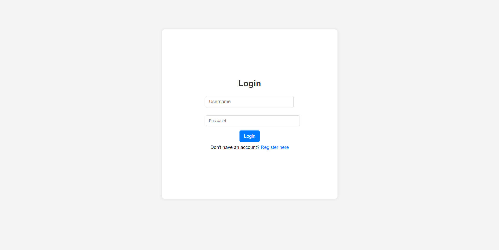
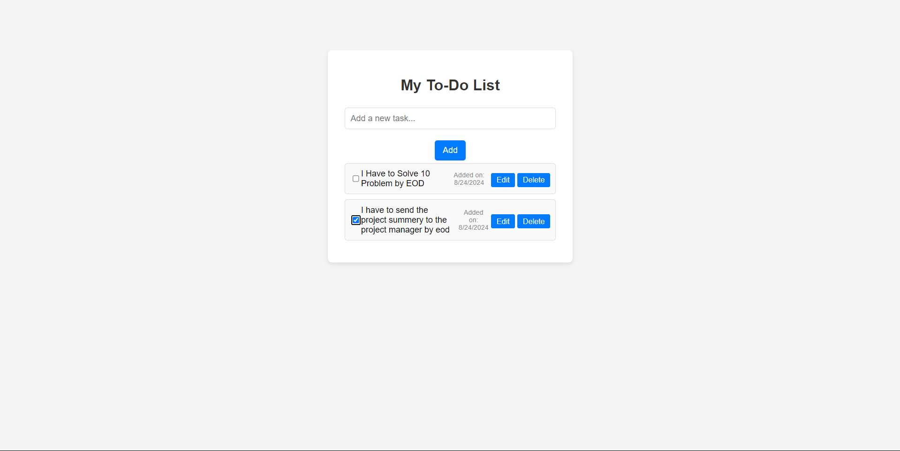

# To-Do List 

[**🌐 Live Demo**](https://anujsingh21.github.io/ToDo-List/).

## 🔍 Overview

This is a To-Do List application built using HTML, CSS, and JavaScript. It includes user authentication (login and registration), allowing users to manage their tasks efficiently. Users can add tasks with date and time, and also edit or delete tasks once completed. The application is designed to be simple and user-friendly.

## 💡 Features

- **🔒 User Authentication**: Register and log in to manage your tasks.
- **➕ Add Tasks**: Create tasks with a specified date and time.
- **✏️ Edit Tasks**: Modify task details as needed.
- **🗑️ Delete Tasks**: Remove tasks that are no longer required.
- **✅ Mark as Completed**: Check off tasks once they are completed.

## 🛠️ Technologies Used

- **🌐 HTML**: Structure of the application.
- **🎨 CSS**: Styling and layout.
- **💻 JavaScript**: Interactivity and functionality.

## 📷 Screenshots

## 🚀 Usage

1. **📝 Register**: 
   - Navigate to the registration page (`todo.html`).
   - Fill out the registration form with your desired username and password.
   - Click "Register" to create your account.

2. **🔑 Log In**: 
   - Open the login page (`index.html`).
   - Enter your username and password into the respective fields.
   - Click "Log In" to access your To-Do List.

3. **🗂️ Manage Tasks**:
   - **➕ Add Task**:
     - Once logged in, go to the To-Do List page.
     - Use the form to enter the task details, including the title, description, date, and time.
     - Click "Add" to save the new task to your list.
   
   - **✏️ Edit Task**:
     - Find the task you want to modify in your To-Do List.
     - Click the "Edit" button next to the task.
     - Make your changes in the provided fields.
     - Click "Save" to update the task details.
   
   - **🗑️ Delete Task**:
     - Locate the task you want to remove from your list.
     - Click the "Delete" button next to the task.
     - Confirm the deletion to remove the task from the list.
   
   - **✅ Mark as Completed**:
     - Check the checkbox next to the task you have completed.
     - The task will be marked as completed and moved to the completed section of your list.

## License
This project is licensed under the [MIT License](LICENSE).

